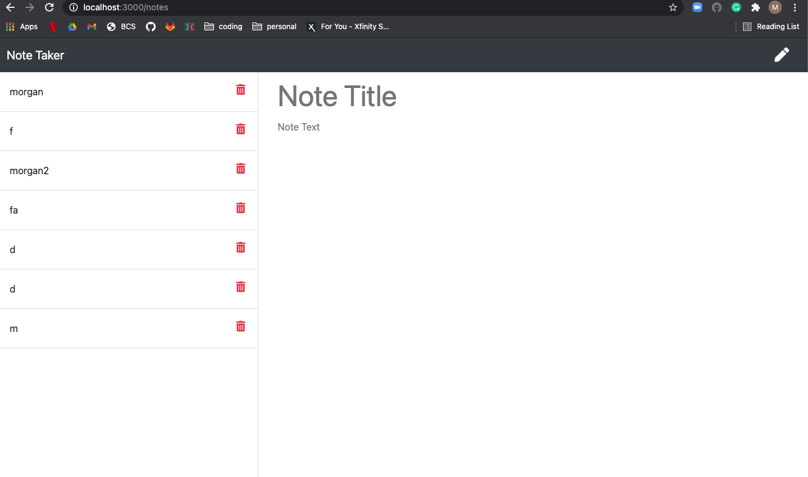
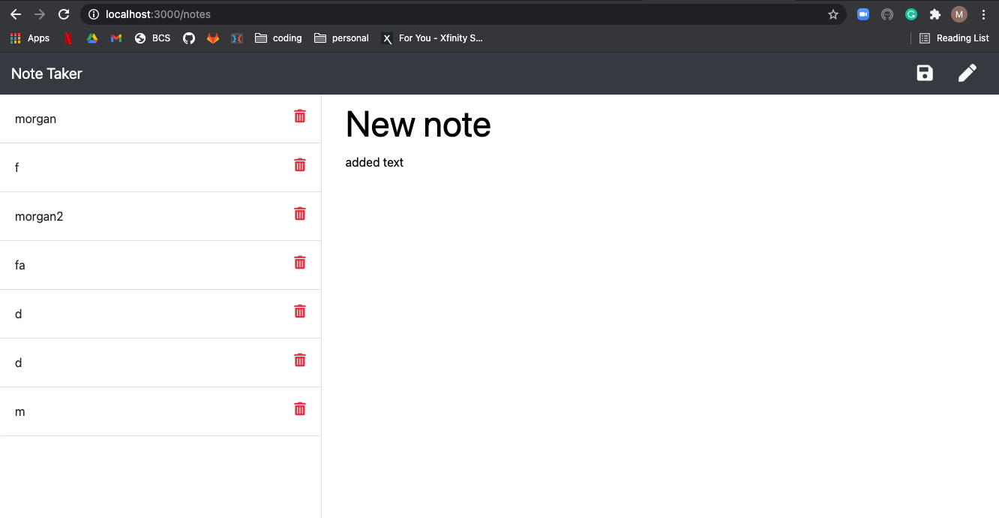

  # Note_Taker
  

  ## Description
  This is an application that allows you to make a new note and saves it to the server. This is all done through the server using express.

  ## table of Contents
  * [Installation](#installation)
  * [Liscense](#liscense)
  * [Contributing](#contributing)
  * [Tests](#tests)
  * [Questions](#questions)

  ## Installation
  Run 'npm run start' in your integrated terminal through the server.js file. This will connect your server to your localhost. Then open Chrome and type in https://localhost:3000 and you will be directed to the homepage.

  ## Screenshots
  Shows saved notes on the left hand side and when you refresh they remain
  
  Shows a new note being written and the saved button appears in order to save
  

  ## License
  MIT
 

  ## Contributing
  Morgan Franke and my tutor Nick Karrasant
  
  ## Tests
  None

  ## Questions
  If you have questions email me at morganleighfranke@gmail.com
  Github profile: https://github.com/morganleighfranke
  Email: see above
  